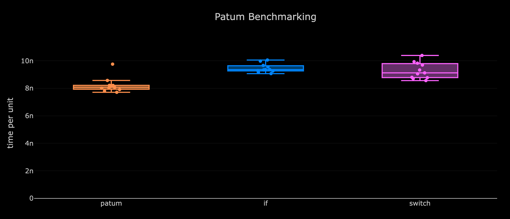
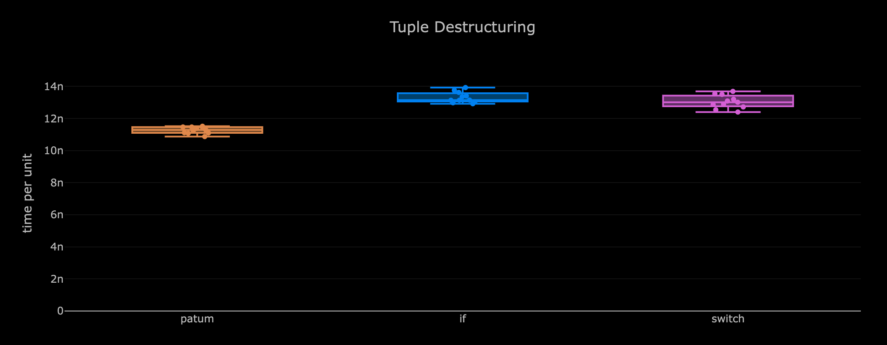

# patum
Patum is a festival of pattern matching for c++20 dressed in a header only constexpr library.

### Disclaimer: No macros have been harmed for making this library !

[](https://github.com/kunitoki/patum/actions/workflows/ci.yml)

## Examples

Simple value matching (and constexpr!):
```cpp
using namespace ptm;

int x = 12;

match(x)
(
    pattern(12) = [&] { std::cout << "found matching value:" << x; },
    pattern(_)  = []  { std::cout << "found nothing"; }
);

match(x)
(
    pattern(12) = [](auto&& x) { std::cout << "found matching value:" << x; },
    pattern(_)  = []  { std::cout << "found nothing"; }
);

static_assert(
    match(12)
    (
        pattern(12) = [](auto x) { return x * 2; },
        pattern(_)  = [](auto x) { return x / 2; }
    ).value_or(0) == 24;
);
```

Single value match with assignment from values or invocables:
```cpp
using namespace ptm;

int x = 5;

auto matched_pattern = match(5)
(
    pattern(10) = 1,
    pattern(5)  = [] { return 2; },
    pattern(3)  = 3
);

// The matched_pattern variable is a std::optional<int>
assert(matched_pattern.value_or(0) == 2);
```

Multi value matching:
```cpp
using namespace ptm;

int x = 1, y = 100;

match(x, y)
(
    pattern(1, _)   = [&] { std::cout << "found matching values:" << x << "," << y; },
    pattern(_, 100) = [&] { std::cout << "found matching values:" << x << "," << y; },
    pattern(1, 100) = [&] { std::cout << "found matching values:" << x << "," << y; },
    pattern(_)      = []  { std::cout << "found nothing"; }
);
```

Range support matching for integrals:
```cpp
using namespace ptm;

int x = 12;

match(x)
(
    pattern(range(1, 20)) = [&] { std::cout << "found matching value:" << x; },
    pattern(_)            = []  { std::cout << "found nothing"; }
);
```

Set inclusion and exclusion support matching:
```cpp
using namespace ptm;

std::string x = "aaa";

match(x)
(
    pattern(in("aaa", "bbb", "ccc"))  = [&] { std::cout << "found value inside:" << x; },
    pattern(!in("ddd", "eee", "fff")) = [&] { std::cout << "found value outside:" << x; },
    pattern(_)                        = []  { std::cout << "found nothing"; }
);
```

Type checks in matchers:
```cpp
template <class T>
auto stringize_type(T* = nullptr)
{
    using namespace ptm;

    return match(x)
    (
        pattern(is<char*>)             = "char",
        pattern(is<short*>)            = "short",
        pattern(is<int*>)              = "int",
        pattern(is<long*>)             = "long",
        pattern(is<long long*>)        = "long long",
        pattern(is<std::string_view*>) = "string_view",
        pattern(_)                     = "other"
    ).value_or("invalid");
}

int x 42;
std::cout << stringize_type(&x) << " x = " << x;
```

Composable predicates matching:
```cpp
using namespace ptm;

int x = 12;

auto even_or_odd = match(x)
(
    pattern(_x >= 1 && _x <= 20) = [&] { std::cout << "found value between 1 and 20:" << x; },
    pattern(_x % 2 == 0)         = [&] { std::cout << "found an even value:" << x; return true; },
    pattern(_x % 2 == 1)         = [&] { std::cout << "found an odd value:" << x; return false; },
    pattern(_)                   = []  { std::cout << "found nothing"; }
);

if (even_or_odd.has_value())
   std::cout << "the value matched was: " << (*even_or_odd ? "even" : "odd");
```

Easy to write custom composable predicates:
```cpp
using namespace ptm;

template <class F>
constexpr auto is_even(const predicate<F>& p)
{
    return predicate([p](const auto& x) { return p(x) % 2 == 0; });
}

bool should_be_even = false;
bool should_be_odd = false;

match(1337)
(
    pattern(is_even(_x))  = [&] { should_be_even = true; },
    pattern(!is_even(_x)) = [&] { should_be_odd = true; }
);

assert(should_be_odd);
assert(not should_be_even);
```

Optional and pointer types matching:
```cpp
using namespace ptm;

std::optional<int> x = 12;

match(x)
(
    pattern(some())   = []  { std::cout << "found some value"; },
    pattern(some(13)) = [&] { std::cout << "found a 13 value"; },
    pattern(none)     = []  { std::cout << "found no value"; }
    pattern(_)        = []  { std::cout << "found nothing"; }
);
```

Tuple destructure matching:
```cpp
using namespace ptm;

auto x = std::make_tuple(1337, "abc"s);

match(x)
(
    pattern(ds(1337, _))    = [] { std::cout << "found a tuple with 1337"; },
    pattern(ds(_, "abc"))   = [] { std::cout << "found a tuple with 'abc'"; },
    pattern(ds(123, "abc")) = [] { std::cout << "found a tuple with both 1337 and 'abc'"; },
    pattern(_)              = [] { std::cout << "found no matching tuple"; }
);

match(x)
(
    pattern(ds(_x < 1337, _))      = [] { std::cout << "found a tuple with < 1337"; },
    pattern(ds(_x >= 1000, "abc")) = [] { std::cout << "found a tuple with >= 1000 and 'abc'"; },
    pattern(_)                     = [] { std::cout << "found no matching tuple"; }
);
```

Aggregate destructure matching:
```cpp
using namespace ptm;

struct aggregate
{
    int x = 0;
    float y = 1000.0f;
    char z = 'a';
};

auto x = aggregate{ 1337, 42.0f, 'b' };

match(x)
(
    pattern(ds(1338, _, 'a'))                         = [] { std::cout << "found aggregate 1"; },
    pattern(ds(_x <= 1338, _y >= 0.0f, in('a', 'b'))) = [] { std::cout << "found aggregate 2"; },
    pattern(_)                                        = [] { std::cout << "found no matching aggregate"; }
);
```

Regex support (detecting google's re2 if present):
```cpp
using namespace ptm;

match("abcdefg_123456")
(
    pattern(regex(".*_\\d+")) = [] { std::cout << "the string matched!"; },
    pattern(_)                = [] { std::cout << "found no match"; }
);
```

## Features

- [x] Fully constexpr (apart from regex and other strings manipulations)
- [x] Efficient with zero copy, exploiting move semantics
- [x] Single and multiple match expressions
- [x] Match return value support using common type
- [x] Matchers lambda support with captures and return value
- [x] Catch all matcher wildcard
- [x] Integral types range matcher
- [x] Set inclusion matcher
- [x] Some and None matchers for std::optional, raw and smart pointer types
- [x] Typed and valued matchers for std::variant
- [x] Typed matcher for expression
- [x] Regex matcher (std::regex)
- [x] Regex matcher (google's re2 support)
- [x] Destructuring std::tuple / std::pair matcher
- [x] Destructuring aggregates matcher
- [ ] Forwarding destructured matches to match callables
- [x] Composable predicates
- [x] Simple to write custom predicates
- [ ] Ranges support
- [ ] Improved compile time error reporting

## Code generation comparison

### Simple integer switch

<table>
<th> <td> C++ </td> <td> Assembler </td> </th>

<tr>
<td> Patum </td>
<td>

```cpp
int patum_test(int x)
{
    using namespace ptm;

    return match(x)
    (
        pattern(1) = 1,
        pattern(2) = 20,
        pattern(3) = 300,
        pattern(4) = 4000
    ).value_or(0);
}
```

</td>
<td>

```asm
patum_test(int):
  mov eax, 1
  cmp edi, 1
  je .L1
  mov eax, 20
  cmp edi, 2
  je .L1
  mov eax, 300
  cmp edi, 3
  je .L1
  cmp edi, 4
  mov eax, 4000
  mov edx, 0
  cmovne eax, edx
.L1:
  ret
```

</td>
</tr>

<tr>
<td> If </td>
<td>

```cpp
int if_test(int x)
{
    if (x == 1)
        return 1;
    else if (x == 2)
        return 20;
    else if (x == 3)
        return 300;
    else if (x == 4)
        return 4000;

    return 0;
}
```

</td>
<td>

```asm
if_test(int):
  mov eax, 1
  cmp edi, 1
  je .L11
  cmp edi, 2
  je .L14
  cmp edi, 3
  je .L15
  cmp edi, 4
  mov edx, 0
  mov eax, 4000
  cmovne eax, edx
  ret
.L15:
  mov eax, 300
.L11:
  ret
.L14:
  mov eax, 20
  ret
```

</td>
</tr>

<tr>
<td> Switch </td>
<td>

```cpp
int switch_test(int x)
{
    switch(x)
    {
        case 1: return 1;
        case 2: return 20;
        case 3: return 300;
        case 4: return 4000;
    }

    return 0;
}
```

</td>
<td>

```asm
switch_test(int):
  sub edi, 1
  xor eax, eax
  cmp edi, 3
  ja .L18
  mov eax, DWORD PTR CSWTCH.44[0+rdi*4]
.L18:
  ret

CSWTCH.44:
  .long 1
  .long 20
  .long 300
  .long 4000
```

</td>
</tr>

</table>

| relative |               ns/op |                op/s |    err% |     total | Simple Switch
|---------:|--------------------:|--------------------:|--------:|----------:|:--------------
|   100.0% |                8.16 |      122,574,467.84 |    0.9% |      0.74 | `patum`
|    84.8% |                9.62 |      103,969,430.38 |    2.9% |      0.94 | `if`
|    88.7% |                9.20 |      108,709,476.32 |    3.2% |      0.91 | `switch`



### Tuple destructuring

<table>
<th> <td> C++ </td> <td> Assembler </td> </th>

<tr>
<td> Patum </td>
<td>

```cpp
int patum_test(const std::tuple<int, int, int>& x)
{
    using namespace ptm;

    return match(x)
    (
        pattern(ds(1, _, 1)) = 1,
        pattern(ds(2, _, 2)) = 20,
        pattern(ds(3, _, 3)) = 300,
        pattern(ds(4, _, 4)) = 4000
    ).value_or(0);
}
```

</td>
<td>

```asm
patum_test(std::tuple<int, int, int> const&):
  mov edx, DWORD PTR [rdi]
  mov eax, DWORD PTR [rdi+8]
  cmp edx, 1
  je .L2
  cmp edx, 2
  jne .L16
  cmp eax, 2
  mov edx, 0
  mov eax, 20
  cmovne eax, edx
  ret
.L16:
  cmp edx, 3
  je .L17
  cmp edx, 4
  jne .L10
  cmp eax, 4
  mov edx, 0
  mov eax, 4000
  cmovne eax, edx
  ret
.L2:
  cmp eax, 1
  sete al
  movzx eax, al
  ret
.L17:
  cmp eax, 3
  mov edx, 0
  mov eax, 300
  cmovne eax, edx
  ret
.L10:
  xor eax, eax
  ret
```

</td>
</tr>

<tr>
<td> If </td>
<td>

```cpp
int if_test(const std::tuple<int, int, int>& x)
{
    if (std::get<0>(x) == 1 && std::get<2>(x) == 1)
        return 1;
    else if (std::get<0>(x) == 2 && std::get<2>(x) == 2)
        return 20;
    else if (std::get<0>(x) == 3 && std::get<2>(x) == 3)
        return 300;
    else if (std::get<0>(x) == 4 && std::get<2>(x) == 4)
        return 4000;

    return 0;
}
```

</td>
<td>

```asm
if_test(std::tuple<int, int, int> const&):
  mov eax, DWORD PTR [rdi+8]
  cmp eax, 1
  je .L27
  cmp eax, 2
  jne .L21
  cmp DWORD PTR [rdi], 2
  mov edx, 0
  mov eax, 20
  cmovne eax, edx
  ret
.L21:
  cmp eax, 3
  jne .L22
  cmp DWORD PTR [rdi], 3
  mov edx, 0
  mov eax, 300
  cmovne eax, edx
  ret
.L27:
  xor eax, eax
  cmp DWORD PTR [rdi], 1
  sete al
  ret
.L22:
  cmp eax, 4
  jne .L25
  cmp DWORD PTR [rdi], 4
  mov edx, 0
  mov eax, 4000
  cmovne eax, edx
  ret
.L25:
  xor eax, eax
  ret
```

</td>
</tr>

<tr>
<td> Switch </td>
<td>

```cpp
int switch_test(const std::tuple<int, int, int>& x)
{
    switch (std::get<0>(x))
    {
    case 1:
        switch (std::get<2>(x)) {
            case 1: return 1;
        }
        break;

    case 2:
        switch (std::get<2>(x)) {
            case 2: return 20;
        }
        break;

    case 3:
        switch (std::get<2>(x)) {
            case 3: return 300;
        }
        break;

    case 4:
        switch (std::get<2>(x)) {
            case 4: return 4000;
        }
        break;
    }

    return 0;
}
```

</td>
<td>

```asm
switch_test(std::tuple<int, int, int> const&):
  mov eax, DWORD PTR [rdi+8]
  cmp eax, 3
  je .L29
  jg .L30
  cmp eax, 1
  je .L31
  cmp eax, 2
  jne .L38
  xor eax, eax
  mov edx, 20
  cmp DWORD PTR [rdi], 2
  cmove eax, edx
  ret
.L30:
  cmp eax, 4
  jne .L38
  xor eax, eax
  mov edx, 4000
  cmp DWORD PTR [rdi], 4
  cmove eax, edx
  ret
.L38:
  xor eax, eax
  ret
.L29:
  xor eax, eax
  mov edx, 300
  cmp DWORD PTR [rdi], 3
  cmove eax, edx
  ret
.L31:
  xor eax, eax
  cmp DWORD PTR [rdi], 1
  sete al
  ret
```

</td>
</tr>

</table>

| relative |               ns/op |                op/s |    err% |     total | Tuple Destructuring
|---------:|--------------------:|--------------------:|--------:|----------:|:--------------------
|   100.0% |                8.25 |      121,271,308.17 |    1.0% |      0.73 | `patum`
|    82.8% |                9.96 |      100,423,574.10 |    2.5% |      0.99 | `if`
|    78.1% |               10.55 |       94,752,840.29 |    2.5% |      1.02 | `switch`



## Setting up (OSX)

```bash
mkdir build && cd build

cmake -G Xcode ..

open patum.xcodeproj
```
